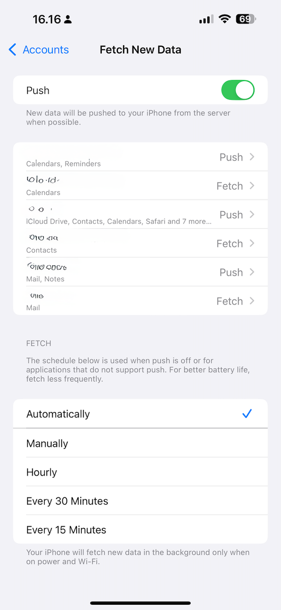
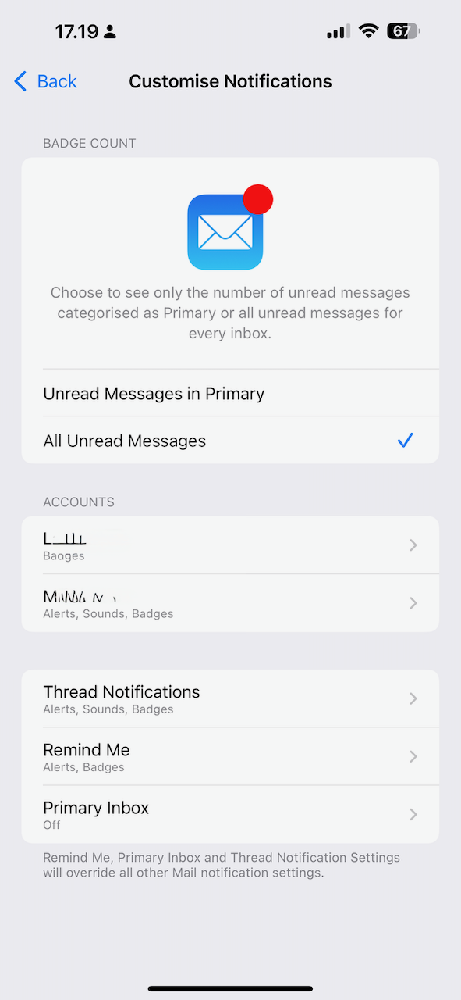

+++
title = "Email notifications with Migadu on iOS"
date = "2025-03-20"
description = "Getting notifications for non-push accounts on iOS"
draft = true

[taxonomies]
tags = ["email", "tech", "ios"]
+++

One of the email providers I use is [Migadu][migadu]. I will talk more about them in a future post,
but for now suffice it to say that they are an amazing provider when you have many domains and want
to manage many different users or mailboxes. It's raw email at its purest form, and I couldn't be
happier with them. They're [also European][migadu-eu], which makes my Europhile heart glow with
pride.

Up until recently, there was one annoyance I had with my Migadu accounts, though. With my other main
provider, FastMail, I was able to have push notifications enabled and be happy. But for some reason,
with Migadu, I would never get notifications on my phone, which would cause me to miss emails
completely.

I decided to dig into the problem once more, and finally found a (partial) solution.

[migadu]: https://migadu.com
[migadu-eu]: https://migadu.com/procon/#in-switzerland-but-servers-are-not

## Push and poll

Let's jump back for a second and talk about terminology for a little bit.

Whenever there is some kind of client/server architecture, the architects building the protocols
need to decide on either push or polling. Push means that the server can initiate a message and
inform a client that there is some kind of update. Polling means that every once in a while, the
client will connect to the server and ask if there's anything new.

This may seem like a minor detail, and it sort of is, however it can have massive impacts on system
load, mobile device battery life, etc. You see, creating network connections is expensive for mobile
devices. Expensive in a power consumption kind of way. In modern mobile operating systems, when we
talk about "push", we effectively mean "we're using the OS' push capabilities". On iOS, this is
commonly called APNs, or _Apple Push Notification service_. This allows, for example, one of
Netflix' servers to send a notification to your phone about a new episode of _Love Island_, without
your phone needing to ask Netflix "hey, got anything new?" every 5 minutes like a junkie.

Try to imagine the scale of that, though. Millions or billions of devices checking in every few
minutes or hours to get an update. There is no good way to design a server architecture to handle
this efficiently. The bandwidth cost alone would be significant.

Email is old. It's properly ancient at this point. It was already properly ancient when Steve Jobs
demoed sending an email from the first iPhone. And because it is so old, the original architects
didn't have to worry about battery life or mobile data usage. They only considered a desktop
computer being turned on once a day with a user clicking "fetch new e-mails" and waiting for the
missives to be downloaded while enjoying a cup of coffee or reading the paper. Or both.

Therefore, standard email is only poll. The email client establishes a connection to the email
server, asks "anything new?", and then disconnects. Because we've become addicted to the
instantaneity of everything, we now also want our mobile devices to get emails as quickly as
possible. In some cases, this might even be necessary: if you get an email with some kind of 2FA
code that is only valid for five minutes but your email client only fetches email once an hour,
that's going to be a problem.

## Enter XAPPLEPUSHSERVICE

Obviously, this concept of polling was terrible for iPhones. Well, it was terrible for all mobile
devices, but most phone manufacturers are not also email server providers---but Apple is, or was.
Apple used to maintain a ["server" edition][macos-server] of macOS which contained an email server.

Apple could've decided to adopt IMAP IDLE/P-IMAP---these are dated respectively from 1997 and
2006,[^1] but they decided to do things their own way. In all fairness, I don't believe this is a
case of the [NIH syndrome][nih]. There were very solid concerns regarding the scalability of IMAP
IDLE (the original document recommends clients check in with the server every 29 minutes, an active
TCP connection must be kept between the client and the server, etc), and the timing of P-IMAP was
not exactly aligning with Apple's timeline. Apple having their own APNs probably also wanted to
dogfood it, to try and prove its capabilities. Thus, Apple built a proprietary extension to IMAP in
their macOS Server Mail server with the XAPPLEPUSHSERVICE command which registers the device for
push notifications without needing to have an active IMAP connection.

This system worked quite well as long as you had an inbox hosted by either iCloud or an Apple email
server. In 2015, [FastMail became][fm-push] the first external provider to officially support
XAPPLEPUSHSERVICE, apparently with Apple's blessing.

Over the next few years, Apple slowly retired macOS server, and doing so, the only reference
implementation of XAPPLEPUSHSERVICE---safe maybe for the FastMail one. There [have been][tzeejay]
some efforts to [try and implement][wildduck] the extension [in other MTAs][dovecot][^2] with
varying degrees of success. Some email providers have [refused to implement it][posteo] due to
alleged privacy issues (Apple could potentially track phone/email associations and the contents of
the emails).

All in all, what it means is that iPhones are slightly stunted when it comes to less popular email
providers and the native Mail app.

[nih]: https://en.wikipedia.org/wiki/Not_invented_here
[pimap]: https://datatracker.ietf.org/doc/html/draft-maes-lemonade-p-imap-12
[lemonade]: https://www.rfc-editor.org/rfc/rfc5550.html
[fm-push]: https://www.fastmail.com/blog/push-email-now-available-in-ios-mail/
[macos-server]: https://en.wikipedia.org/wiki/Mac_OS_X_Server
[tzeejay]: https://www.tzeejay.com/blog/2018/03/project-xapplepushservice/
[wildduck]: https://github.com/zone-eu/wildduck/issues/711
[dovecot]: https://github.com/st3fan/dovecot-xaps-plugin
[posteo]: https://discussions.apple.com/thread/255342888?sortBy=rank

[^1]: The original [P-IMAP RFC][pimap] was drafted in 2006 and subsequently abandoned, but the
[Lemonade RFC][lemonade] was only published in 2009.
[^2]: Mail Transfer Agent, aka an email server.

## Practical implications

What does this mean, in practice? Well, if you're using iOS and the Mail app with some providers,
you might have noticed that you don't get emails delivered immediately. They probably arrive
instantly on macOS (whose Mail app implements IMAP IDLE---confused yet?), but only show up on your
iPhone when you open the Mail app, or when your phone is on WiFi and charging.

If you navigate to Settings > Apps > Mail > Mail Accounts > Fetch New Data, you'll find the settings
that control this.

The top part of the screen shows the accounts you have configured and whether they are capable of
using Fetch or Push. The bottom part shows how Fetch accounts are managed. By default, your phone is
most likely configured to use the "automatic" fetch schedule. There's a little piece of grey text at
the bottom that I'd like to highlight:

> Your iPhone will fetch new data in the background only when on power and Wi-Fi.

Considering how many people these days don't even have WiFi at home, this effectively means that for
a good and growing chunk of users, some emails will never be downloaded unless the user manually
opens the Mail app and watches as the messages stream in. I also know many people who exclusively
charge their phone in the car on their way to and fro' work. Switching this to "Hourly" has been
working pretty decently for me, although I decided to go down to every half hour for now and try
that out.

**Note**: It might be worthwhile reducing the number of accounts listed here that are configured as
"Fetch", as every account of that type will now be refreshed at a fixed interval, which might affect
battery life. I will definitely be pruning some of the calendars from that list, but that's a
problem for future me.

Okay, so our phone is now finally capable of fetching the emails in the background. Why am I still
not getting any notifications? Well, there's another setting, buried deep within the maze that is
iOS settings.

**Full disclosure**: I don't know if I did something wrong and misconfigured something, or if there
is another reason why the following setting was set as it was, however I'm just documenting it here
for myself, and hopefully to help someone else out.

After probably two years of not getting notifications, it suddenly clicked that maybe the lack of
notifications I was seeing was due to my phone not downloading my emails, but simply not notifying
me about them.

Navigate to Settings > Apps > Mail > Notifications > Customise Notifications and you'll be greeted
with a screen similar to this:

The one thing you might notice is that the first account, hosted by Migadu, only has the "Badges"
notification permission, whereas the second one, hosted by FastMail, has access to all notification
types. Enabling "Alerts" solves the entire problem. I now get notifications for all emails exactly
as I'd like.

## Closing thoughts

There's a few avenues I might explore. First, I might reach out to the Migadu team to see what their
position is on the topic. Maybe they're already working on something, or maybe they're entirely
opposed to giving Apple the time of day. It could also be fun to try and implement my own MTA-proxy
that provides XAPPLEPUSHSERVICE on top of an existing mailbox that provides IMAP IDLE. Email is that
weird protocol that I can't stop messing with, for decades now.

It's a shame that Apple is making this so difficult. I really wish they would at least publish some
kind of either reference implementation (that they clearly still have in some Python source code
format) or documentation about the command and its implementation.

Alternatively, it would be fantastic if Apple properly implemented IMAP IDLE on iOS just like it has
on macOS, or whatever better alternative there is today. I'm convinced Apple throwing its weight
behind a specific implementation (JMAP?) would piss some people off, but it would also bring
alignments to many MTAs.

In the current state, Apple has created a weird void in the Push-Email capabilities that might cause
people to stop using the Mail app and make them over-reliant on third-party apps to handle email,
just to provide real-time notifications. Email, for all its faults, is remarkably one of the last
systems where using independent clients, servers and services is still entirely possible, and I'd
hate to lose that.
