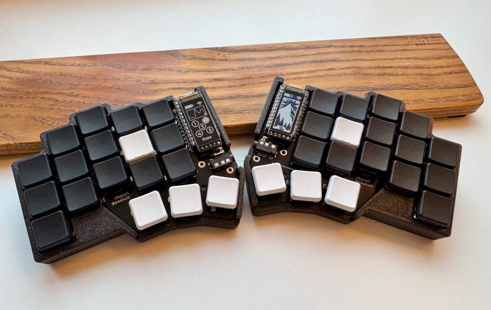

+++
title = "Switching to a split keyboard"
date = "2025-02-13"
description = "Documenting my transition to custom split mechanical keyboards."

[taxonomies]
tags = ["tech", "keyboard"]
+++

I'm not going to lie: I'm typing this at an excruciatingly low speed. For the past twenty years I've
been used to typing nearly as fast as I could think, or at the very least, talk. This previous
sentence, however, took me well over a minute to write down. As I mentioned a few days ago, I have
decided to switch to a new keyboard layout. While the layout itself is still QWERTY, I am now using
what is commonly referred to as a custom split ortholinear staggered-column mechanical keyboard.



As you can probably tell, this keyboard has significantly fewer keys than a typical one, and that's
sort of the point. This kind of keyboard layout is designed to try and reduce the amount of
movements your hand is making in order to reach all the keys on your keyboard.

The learning curve has been absolutely brutal. I was able to get a single time over 50 wpm, and that
was definitely a fluke. After a couple days of use, I am now consistently getting 30-40 wpm. I'm not
convinced attempting to write a lot during this transition phase is the greatest of ideas, but it
seems to me like the only way out is to practice.

Interestingly enough, one of the keys I struggle with the most is the c letter, which is tucked
below the d key. This means that I should in theory use my middle finger in order to hit it, but on
regular keyboards I seem to have taken the habit of using my index finger. The result is that nearly
every time I try to type c, I end up typing v. Even now, when I was consciously thinking through the
process and explaining it.

The next section will be a bit more technical as I document things that were not immediately clear
to me.

## Homerow mods

Beyond the key layout difference, the biggest change is the use of homerow mods in order to access
the keys most people have around their boards. Most keyboards tend to come with a couple shift keys,
some control, alt and even super (Windows/Mac) keys. These don't exist on a 36 key keyboard, so you
have to get creative.

One way the community has solved this is by inventing homerow mods. What it means is that the keys
on your homerow (e.g.: asdf-hjkl) have double duty. If I just tap 'j', I obviously get 'j'. However
if I hold 'j' for just a short while, it turns into a shift key. F does the same thing, just on the
other side of the keyboard, in case there are collisions. The same is true for my control keys (d
and k), alt (s and l) and super (a and ').

This is a major shift (pun intended) in how I type, and have to think about typing.

## Firmware customisation

This keyboard is based on the nice!nano v2 microcontrollers. These provide wireless connectivity, so
I am using the [ZMK][zmk] firmware (ZMK appears to be more geared towards wireless keyboards whereas
[QMK][qmk] seems to be mostly wired). I decided to start with a layout based on the reasonably popular
[Miryoku][miryoku] layout. I talk about a layout, however I have decided to stick with QWERTY for
now. The layout, therefore, only refers to the different layers I have on the keyboard, and where
keys are positioned within those.

[zmk]: https://zmk.dev/
[qmk]: https://qmk.fm/
[miryoku]: https://github.com/manna-harbour/miryoku

The first thing I wanted to do was adding combos, or chords I've grown quite used to over the past
few months. Here are the chords I want to achieve; all for Danish:

- 'o' and 'e' to produce 'ø',
- 'a' and 'e' to produce 'æ',
- 'a' and 'o' to produce 'å'.

In order to achieve this, I had to define some macros and combos in the firmware:

```c
/ {
    macros {
        oe: oe {
            compatible = "zmk,behavior-macro";
            #binding-cells = <0>;
            wait-ms = <MACRO_TIMEOUT>;
            bindings = <&macro_tap &kp RA(O)>;
        };
    };

    combos {
        compatible = "zmk,combos";
        combo_oe {
            timeout-ms = <COMBO_TIMEOUT_SLOW>;
            key-positions = <3 9>;
            bindings = <&oe>;
        };
    };
};
```

The full customisation can be found [here][gh-custom-behavior] (remember to include this file
otherwise it will have no effect). The most confusing thing in this was actually that the key
numbers did not line up with the physical keyboard I had in front of me. Because this
[chocofi][chocofi] keyboard is quite similar to a [corne][corne] keyboard, that's the layout that is
used. Miryoku doesn't use the extra keys on a corne anyway. The big difference is that the corne has
42 keys whereas the chocofi only has 36. So instead of just being able to count the keys on the
physical object in front of me, I had to mentally remove some imaginary key numbers.

[gh-custom-behavior]: https://github.com/teotwaki/miryoku_zmk/blob/master/miryoku/custom_behaviors.dtsi
[chocofi]: https://github.com/pashutk/chocofi
[corne]: https://github.com/foostan/crkbd

So what does this actually do? The combo says that if keys 3 and 9 are pressed simultaneously within
certain timeout, the macro should be invoked. The macro says that when it is invoked, it will
generate a single key press of `RA(O)`, which means `right alt + O`, which on my Mac, produces an ø.
I suppose that this might be done without the use of a macro, just by using a combo alone, however I
need to add support for the uppercase form of these letters as well. I don't expect that will be
doable without a macro.

For future reference, here is what the key mapping looks like on a chocofi for ZMK:

```
-------------------------------------------
│  1   2   3   4   5 │  6   7   8   9  10 │
│ 13  14  15  16  17 │ 18  19  20  21  22 │
│ 25  26  27  28  29 │ 30  31  32  33  34 │
--------- 36  37  38 │ 39  40  41 ---------
          -----------------------
```

At the moment, I am focusing my attention on getting this keyboard to play nicely with my Mac only,
and will add the complexity of other OS' later on. On my current TODO list is fixing the layout as I
don't currently have access to a tilde key, which is kind of important for me. I also need to
improve the 3D-printed case of the keyboard so that it sits in a more stable way on my desk. At the
moment it's slightly janky and tends to tilt when I press some keys which is not entirely
comfortable. I might also need to work on the timing of some chording/tapping behaviour; I sometimes
generate unwanted key presses when I start typing a bit faster, especially with some rolls such as
'st'.

Another comfort I'd like to get back somehow would be some form of caps lock. The main reason for
this is that with the homerow mods it can get a bit tiresome to switch from one hand to the other to
maintain shift when typing longer uppercase things (constants in Rust or other programming languages
come to mind). I know there's support for this in ZMK, but I haven't been able to figure out whether
it's already available in Miryoku.

Edit: This turned out to be a non-issue. Miryoku has this built-in, and the reason I couldn't find
it is because I use the vi-shifted navigation layout. ZMK has a feature called [caps
words][caps-words] which, when turned on, capitalises all letters until a non-alphanumerical
character is pressed. This luckily also includes underscores, so it's a perfect fit for programming.
On Miryoku this is activated by pressing `nav + /`.

[caps-words]: https://zmk.dev/docs/keymaps/behaviors/caps-word
